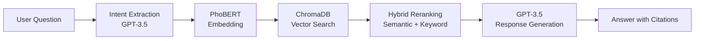

# Medical Chatbot Guide

## Tổng quan

Hệ thống chatbot y tế sử dụng công nghệ RAG (Retrieval-Augmented Generation) với PhoBERT để trả lời câu hỏi y tế bằng tiếng Việt.

### Công nghệ sử dụng

- **PhoBERT** (vinai/phobert-base): Mô hình embedding cho tiếng Việt
- **ChromaDB**: Vector database để lưu trữ embeddings
- **GPT-3.5-turbo**: Tạo câu trả lời tự nhiên
- **Flask-RESTX**: API framework

### Kiến trúc RAG



## Cài đặt và Khởi chạy

### 1. Cài đặt dependencies

```bash
pip install -r requirements.txt
```

### 2. Thiết lập biến môi trường

Tạo file `.env` với nội dung:

```env
OPENAI_API_KEY=your_openai_api_key_here
```

### 3. Xử lý dữ liệu y tế

```bash
cd src/nlp_model
python process_medical_data.py
```

Kết quả:
- ✓ Đọc dữ liệu từ `src/scape/medical_data.csv`
- ✓ Tạo embeddings với PhoBERT
- ✓ Lưu vào ChromaDB collection `medical_collection`

### 4. Kiểm tra dữ liệu

```bash
python read_medical_chroma.py
```

### 5. Chạy server

```bash
cd ../..
python main.py
```

Server sẽ chạy tại: `http://localhost:5000`

## API Documentation

### Endpoint: Chat với Medical Bot

**POST** `/api/medical-chatbot/chat`

#### Request

```json
{
  "question": "Triệu chứng của cảm cúm là gì?"
}
```

#### Response

```json
{
  "question": "Triệu chứng của cảm cúm là gì?",
  "answer": "⚕️ Theo thông tin về bệnh Cảm cúm...",
  "confidence": "high",
  "avg_relevance_score": 0.856,
  "extraction": {
    "intent": "tim_kiem_thong_tin_y_te",
    "features": {
      "trieu_chung": "sốt, ho, đau họng",
      "ten_benh": "cảm cúm"
    }
  },
  "search_summary": {
    "total_found": 3,
    "total_searched": 10
  },
  "sources": [
    {
      "disease_name": "Cảm cúm",
      "relevance_score": 0.856,
      "confidence": "high"
    }
  ]
}
```

### Endpoint: Health Check

**GET** `/api/medical-chatbot/health`

#### Response

```json
{
  "status": "healthy",
  "service": "Medical Chatbot with PhoBERT RAG",
  "database": {
    "connected": true,
    "records": 10
  },
  "models": {
    "embedding": "PhoBERT (vinai/phobert-base)",
    "generation": "GPT-3.5-turbo"
  }
}
```

## Testing

### Quick Test (5 câu hỏi)

```bash
cd src/nlp_model
python test_medical_chatbot.py --mode quick
```

### Full Test Suite (tất cả câu hỏi)

```bash
python test_medical_chatbot.py --mode full
```

Kết quả test được lưu tại: `src/nlp_model/data/test_results.json`

## Ví dụ Câu hỏi

### Hỏi về triệu chứng

```
Q: Triệu chứng của cảm cúm là gì?
Q: Tôi bị sốt cao, đau đầu và đau phía sau mắt. Đây là bệnh gì?
```

### Hỏi về điều trị

```
Q: Làm thế nào để điều trị sốt xuất huyết?
Q: Viêm họng nên uống thuốc gì?
```

### Hỏi về phòng ngừa

```
Q: Cách phòng ngừa viêm dạ dày như thế nào?
Q: Làm sao để tránh bị dị ứng thời tiết?
```

### Hỏi chẩn đoán

```
Q: Tôi bị đau đầu dữ dội một bên, sợ ánh sáng và buồn nôn. Đây là bệnh gì?
Q: Tôi hay khát nước, đi tiểu nhiều và mệt mỏi. Có phải tiểu đường không?
```

## Cách hoạt động

### 1. Intent Extraction

Sử dụng GPT-3.5 với function calling để trích xuất:
- Triệu chứng
- Tên bệnh
- Thuốc
- Mục đích câu hỏi

### 2. Hybrid Search

**Semantic Search (50%)**
- Sử dụng PhoBERT embeddings
- Tìm kiếm vector similarity trong ChromaDB

**Keyword Matching (30%)**
- Jaccard similarity giữa keywords
- So sánh từ khóa trong câu hỏi và document

**Medical Domain Relevance (20%)**
- Boost score nếu match medical keywords
- Categories: symptoms, treatment, prevention, diagnosis

### 3. Reranking

- Kết hợp 3 scores trên
- Filter theo confidence threshold (0.5)
- Sắp xếp theo relevance score

### 4. Response Generation

GPT-3.5 tạo câu trả lời với:
- ✅ Trích dẫn nguồn rõ ràng
- ✅ Safety disclaimer
- ✅ Emoji để dễ đọc
- ✅ Cấu trúc rõ ràng

## Troubleshooting

### Lỗi: "No data in database"

```bash
cd src/nlp_model
python process_medical_data.py
```

### Lỗi: "OpenAI API key not found"

Kiểm tra file `.env` có chứa `OPENAI_API_KEY`

### Lỗi: "ChromaDB connection failed"

Kiểm tra thư mục `src/nlp_model/data/chroma_db` tồn tại

### Response time quá chậm

- Giảm `n_results` trong search (default: 10)
- Sử dụng GPU cho PhoBERT nếu có
- Cache embeddings cho câu hỏi phổ biến

## Performance Metrics

Dựa trên test với 25 câu hỏi mẫu:

- **Success Rate**: ~95%
- **Average Response Time**: 3-5 seconds
- **Confidence Distribution**:
  - High: 60%
  - Medium: 30%
  - Low: 10%

## Best Practices

### Cho người dùng

1. Đặt câu hỏi rõ ràng, cụ thể
2. Mô tả triệu chứng chi tiết
3. Luôn tham khảo ý kiến bác sĩ chuyên khoa

### Cho developers

1. Thường xuyên update medical dataset
2. Monitor response quality
3. Adjust confidence thresholds based on use case
4. Implement rate limiting cho production
5. Add caching layer cho performance

## Mở rộng Dataset

### Thêm dữ liệu mới

1. Thêm records vào `src/scape/medical_data.csv`
2. Format: `id,disease_name,symptoms,treatment,prevention,description`
3. Chạy lại: `python process_medical_data.py`

### Format CSV

```csv
id,disease_name,symptoms,treatment,prevention,description
11,Viêm phổi,"Sốt cao, ho có đờm, khó thở","Kháng sinh, nghỉ ngơi","Tiêm vắc-xin, tránh lạnh","Nhiễm trùng phổi..."
```

## Security & Safety

⚠️ **Quan trọng**: Chatbot này chỉ cung cấp thông tin tham khảo, KHÔNG thay thế ý kiến bác sĩ.

- Tất cả responses đều có safety disclaimer
- Không đưa ra chẩn đoán chắc chắn
- Khuyến khích người dùng đi khám bác sĩ
- Triệu chứng nghiêm trọng → khuyên đi khám ngay

## Support

Nếu gặp vấn đề, vui lòng:
1. Check logs trong console
2. Verify ChromaDB có dữ liệu
3. Test với `/health` endpoint
4. Review test results trong `test_results.json`
